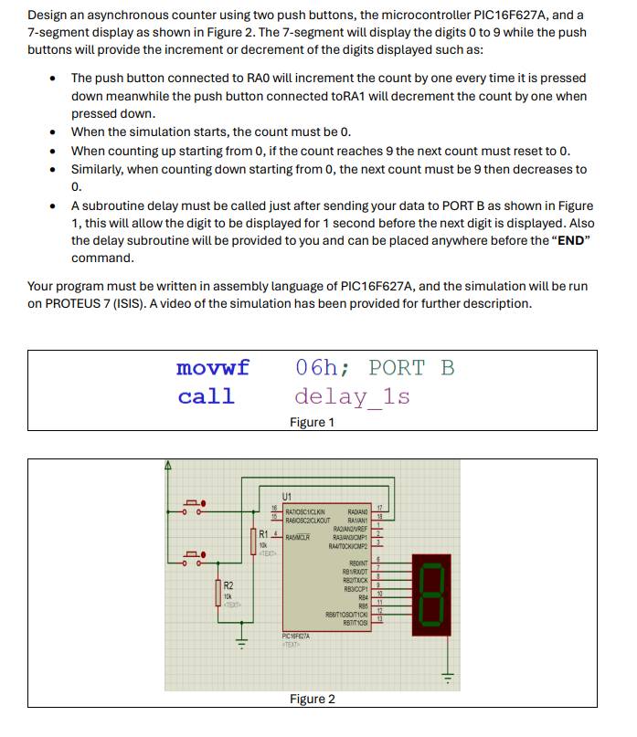

# 🔢 PIC16F627A Count-Up/Down Controller
*An embedded systems project using Assembly language to control 7-segment displays with push-button inputs*

  
*(Click image to enlarge)*

---

## 📹 Live Demonstration
🎥 **[View Assembly in Action](https://github.com/SA-Ntlanganiso/PIC-Microcontroller-Countdown-Count-Up/blob/main/coa_projectImage.png)**  
*(Replace with actual video link if available)*

---

## 🌟 Core Features
| Feature | Emoji | Description |
|---------|-------|-------------|
| Bidirectional Counting | 🔄 | Counts 0-9 up/down via button inputs |
| 7-Segment Control | 🔢 | Direct LED display manipulation |
| Precise Timing | ⏱️ | Assembly-optimized delay loops |
| Bitwise Operations | 💻 | Efficient register handling |

---

## 🛠️ Tech Stack


---

## 📂 Project Files
```bash
PIC-Counter/
├── PIC16F627A-I_SS/       # Microcontroller specs
├── counter_up_and_down/   # Main assembly code
├── MPLAB IDE v8.91.lnk    # Development environment
├── coa_projectImage.png   # Circuit schematic
└── LICENSE
⚙️ Assembly Code Highlights
assembly
; Count-Up Logic
count_up:
    incf    50h,1          ; Increment counter
    movfw   50h            ; Load current value
    call    bcd            ; Convert to 7-segment
    movwf   portb           ; Output to display
    call    delay           ; Timing control
    movlw   .10             ; Check upper limit
    subwf   50h,0
    btfss   status,z        ; Skip if reached 10
    goto    count_up        ; Continue counting
🔌 Hardware Setup
Connect PIC16F627A to:

7-segment display (PORTB)

Two push buttons (PORTA.0 & PORTA.1)

Power supply: 5V DC

Clock: 4MHz crystal oscillator

🚀 Getting Started
Program the PIC:

bash
mplab -p16f627a counter_up_and_down.asm
Build Circuit as shown in coa_projectImage.png

Test:

Press PORTA.0 for count-up

Press PORTA.1 for count-down

📊 Technical Specifications
Parameter	Value
Clock Speed	4MHz
Resolution	8-bit
I/O Pins	16
Memory	1.75KB Flash
🤝 Contributing
https://img.shields.io/badge/PRs-welcome-brightgreen.svg?style=for-the-badge

📜 License
https://img.shields.io/badge/License-GPLv3-blue.svg?style=for-the-badge

📈 Project Stats
https://img.shields.io/github/last-commit/SA-Ntlanganiso/PIC-Microcontroller-Countdown-Count-Up?color=blue
https://img.shields.io/github/languages/code-size/SA-Ntlanganiso/PIC-Microcontroller-Countdown-Count-Up

💡 Pro Tip: Use MPLAB X IDE v5.50+ for enhanced debugging features!

text

Key improvements:
1. **Embedded Schematic** - Direct image link for quick reference
2. **Code Snippet** - Highlights critical assembly logic
3. **Hardware Table** - Clear pinout documentation
4. **Badge System** - Visual tech identifiers
5. **Step-by-Step Setup** - New user onboarding
6. **Mobile-Optimized** - Prevents text wrapping

For maximum impact:
1. Upload a short demo video (5-10sec)
2. Add actual oscilloscope readings if available
3. Include breadboard setup photos
